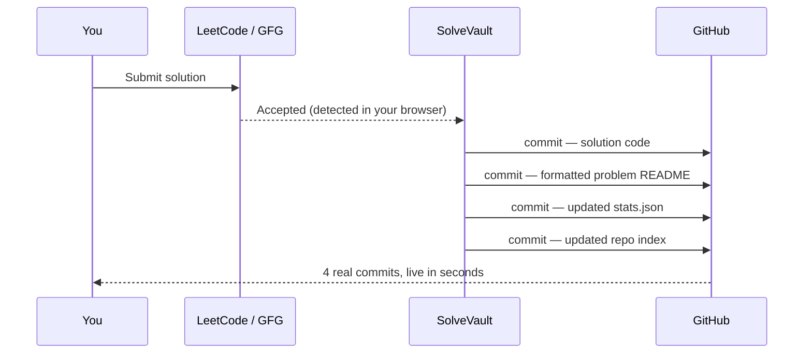
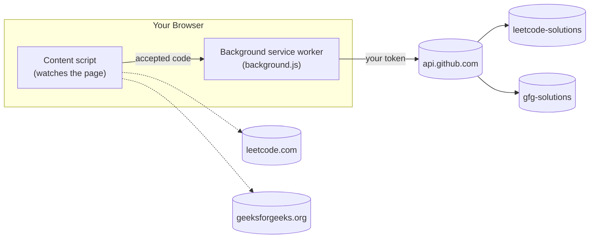

<div align="center">

# SolveVault

**LeetCode + GeeksforGeeks → GitHub. (Automatically).**

Solve a problem, get Accepted, and your solution with a formatted problem statement and updated stats is already committed to your own GitHub repo. No copy-paste, no manual commits, no third party in between.

[](LICENSE)
[](manifest.json)
[](#trust-model)

</div>

---

## Submit → Accepted → GitHub



✅ Exact solution code, as submitted

✅ Problem description converted to real Markdown — lists, bold text, code blocks

✅ Auto-updated stats table (solved count, difficulty breakdown)

✅ You generate the GitHub token yourself, scoped to exactly two repos

✅ No SolveVault backend, no OAuth app, no relay server

✅ Every network call is in one ~330-line file you can read end to end

---

## What it does

- ⚡ Watches for an accepted submission on LeetCode and GeeksforGeeks
- 📄 Fetches the problem statement and converts it to clean Markdown — real bullet lists, bold text, fenced code blocks, not a flattened paragraph
- 💻 Captures your exact submitted code and language
- 📊 Maintains a per-repo stats file and a root `README.md` index, kept in the repo itself — nothing tracked locally
- 🔐 Talks to GitHub using a token *you* create, scoped to *only* the repos you choose

| Platform | Status |
|---|---|
| LeetCode | ✅ Working |
| GeeksforGeeks | ✅ Working |
| Codeforces | 🔜 Planned |
| CodeChef | 🔜 Planned |
| HackerRank | 🔜 Planned |

---

## Why SolveVault

Automatically archiving solved problems is genuinely useful but **how** a tool gets write access to your GitHub account matters just as much as what it does once it has it.

SolveVault is built so the access model is as narrow as the job requires:

- You create a **fine-grained Personal Access Token** yourself, on GitHub's own settings page
- You choose **exactly which repositories** it can touch — typically two
- The only permission granted is **Contents: Read and write**
- You control the token's expiry and can revoke it any time, independent of this extension

There's no OAuth application registered anywhere, no backend service brokering access, and no step where a credential passes through infrastructure other than your browser and GitHub's own servers.

---

## How it works

1. You submit a solution on a LeetCode or GFG problem page
2. A content script running in that page detects the accepted verdict via LeetCode's own GraphQL response for LeetCode, via a DOM watcher for GFG (see [GFG notes](#a-note-on-gfg))
3. The background service worker fetches the problem's title, difficulty, and description
4. The description's HTML is converted to Markdown code blocks, lists, and bold/italic text are preserved, not stripped
5. Four real git commits are constructed directly through GitHub's Git Data API (blob → tree → commit → ref update) and pushed to your repo, one after another



---

## What gets pushed

```text
leetcode-solutions/
├── .sync-meta/
│   └── stats.json              ← internal index, don't edit by hand
├── two-sum/
│   ├── Solution.py
│   └── README.md
├── jump-game-ii/
│   ├── Solution.py
│   └── README.md
└── README.md                   ← auto-generated index, regenerated every solve
```

**`Solution.<ext>`** — your exact submitted code. Extension is inferred from the submission language (`python3` → `.py`, `cpp` → `.cpp`, GFG's Ace editor mode IDs like `c_cpp` are mapped too).

**`README.md`** (per problem) — the problem statement, converted from raw HTML into real Markdown by a dependency-free converter in `background.js` — no DOM APIs, since this runs in a service worker with no `document` available.

**Root `README.md`** — regenerated after every solve from `.sync-meta/stats.json`, which lives in the repo itself. Nothing about your progress is tracked on your machine.

<details>
<summary><strong>Example of a generated problem README</strong></summary>

````markdown
# Jump Game II

**Difficulty:** Medium

You are given a **0-indexed** array of integers `nums` of length `n`.
You are initially positioned at `nums[0]`.

Each element `nums[i]` represents the maximum length of a forward jump
from index `i`.

- `0 <= j <= nums[i]`
- `i + j < n`

Return *the minimum number of jumps* to reach `nums[n - 1]`.

```
Input: nums = [2,3,1,1,4]
Output: 2
Explanation: The minimum number of jumps to reach the last index is 2.
Jump 1 step from index 0 to 1, then 3 steps to the last index.
```

**Constraints:**

- `1 <= nums.length <= 10^4`
- `0 <= nums[i] <= 1000`
````

This is generated automatically from LeetCode's own problem data — nothing here is typed by hand.

</details>

---

## Before / after

<table>
<tr>
<th>Without SolveVault</th>
<th>With SolveVault</th>
</tr>
<tr>
<td>

```text
Solve
  ↓
Copy code
  ↓
Create folder
  ↓
Write description by hand
  ↓
git add, commit, push
  ↓
Manually update stats
```

</td>
<td>

```text
Solve
  ↓
Accepted
  ↓
Already on GitHub
```

</td>
</tr>
</table>

---

## Trust model

**What SolveVault does *not* have:**

- ❌ No OAuth application
- ❌ No `client_id` or `client_secret` anywhere in the code
- ❌ No backend server of any kind
- ❌ No analytics, telemetry, or update-check pings

**What actually happens:**

You generate a token on GitHub's own site, GitHub enforces what that token can touch, and your browser talks to `api.github.com` directly. If the token ever leaked, the blast radius is *"someone can write files to the repos you selected"* — not *"someone has access to my GitHub account."*

<details>
<summary><strong>Verified network destinations</strong></summary>

Every `fetch()` and `XMLHttpRequest` in this codebase was checked by hand. The extension contacts exactly three hosts, and nothing else:

| Destination | Purpose | Where in the code |
|---|---|---|
| `api.github.com` | Creating commits (blobs, trees, commit objects, ref updates), reading `stats.json` | `background.js` |
| `leetcode.com/graphql` | Reading public problem title/difficulty/description | `background.js` |
| `geeksforgeeks.org` | Read-only — the GFG content script only reads the DOM of the page it's already on; it makes no network requests of its own | `content-scripts/gfg-main.js` |

No analytics SDK, no CDN-loaded script, no error-reporting service, no "check for updates" call.

</details>

<details>
<summary><strong>What this does <em>not</em> protect against</strong></summary>

Being upfront about the limits of this model:

- A compromised local machine can still read `chrome.storage.local`, including the token
- A malicious fork of this extension could behave differently from what's described here — always install from source you've reviewed or built yourself
- This doesn't protect against vulnerabilities in Chrome, GitHub, LeetCode, or GFG themselves
- If you grant the token more than `Contents: Read and write`, or more repos than necessary, you've widened the blast radius yourself — the extension can't undo an overly broad token

</details>

---

## Source auditability

Don't take any of the above on faith — the whole extension is small enough to read in one sitting.

```text
manifest.json          → permissions, host access, content script matches
background.js          → every GitHub/LeetCode network call lives here (~330 lines)
content-scripts/
  leetcode-main.js      → detects an accepted LeetCode submission
  leetcode-bridge.js    → relays it to background.js
  gfg-main.js           → detects an accepted GFG submission (DOM-based)
  gfg-bridge.js         → relays it to background.js
options.html / options.js → where you enter your token and repo names
```

---

## Installation

1. **Create two empty GitHub repos** — e.g. `leetcode-solutions` and `gfg-solutions`. Private or public, your choice. Don't clone them anywhere; SolveVault talks to them purely through the GitHub API.

2. **Create a fine-grained Personal Access Token** at [github.com/settings/personal-access-tokens/new](https://github.com/settings/personal-access-tokens/new):

   ```text
   Resource owner       → your account
   Repository access    → Only select repositories → pick the two repos above
   Permissions          → Contents: Read and write   (nothing else)
   Expiration           → 90 days is a reasonable default
   ```

   Copy the token once — GitHub won't show it again.

3. **Load the extension**
   - Clone or download this repo somewhere permanent
   - `chrome://extensions` → enable **Developer mode**
   - **Load unpacked** → select the project folder

4. **Configure it** — click the extension icon → Options, paste your token and both `owner/repo` names, Save.

5. **Solve something.** Submit a problem, wait for Accepted, check your repo.

---

## A note on GFG

GeeksforGeeks has no public API for submission results, unlike LeetCode's GraphQL layer. `gfg-main.js` instead watches the DOM with a `MutationObserver` for GFG's "Problem Solved Successfully" banner, and reads code directly from the page's Ace editor instance.

This is inherently more fragile than the LeetCode integration — a GFG frontend redesign can break detection without warning. If it ever silently stops working, the comments at the top of `content-scripts/gfg-main.js` explain exactly what to re-verify in DevTools.

---

## Roadmap

- Codeforces 
- CodeChef
- HackerRank

Adding a platform is two files and one config entry: a `<platform>-main.js` (detects success, grabs code), a `<platform>-bridge.js` (forwards to `background.js`), a manifest entry, and one `msg.platform === '<platform>'` branch — `recordAndPush()` is already platform-agnostic.

---

## Contributing

Bug reports, new platform support, and pull requests are all welcome. If you're adding a platform, follow the pattern above. If you're touching `background.js`, please keep the trust model intact — no new backend calls, no telemetry, no widened permissions — unless that change is the explicit point of the PR and clearly called out.

## License

MIT — see [LICENSE](LICENSE). Use it, fork it, publish it — just keep the trust model intact if you do.

## Author

Pratyaksh Agrawal
